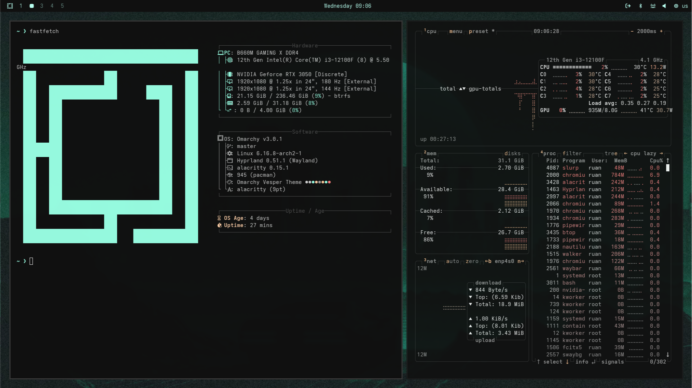

# Omarchy Vesper Theme Port

This project is a port of the **Vesper Theme**, which I personally use in **Visual Studio Code**.

The goal of this port is to bring the same aesthetics, color scheme, and overall visual experience of the Vesper Theme to other environments where it is not natively available.


## Screenshots




## Installation

1. Press **Super + Alt + Space** to open the Omarchy menu.  
2. Select: **Install > Style > Theme**  
3. Paste the link below and press **Enter**:

```bash
https://github.com/Zheonatan/omarchy-vesper-theme.git
```
---

## Special Thanks

A very special thanks to [**dotsilva**](https://github.com/dotsilva) for the incredible help in configuring **Ghostty**, **Kitty**, **Neovim**, and **Visual Studio Code**.

