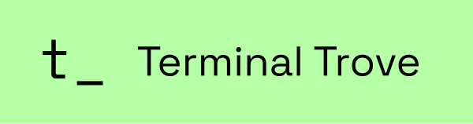

# herdr


<p align="center">
  
</p>

<p align="center">
  <a href="https://herdr.dev">herdr.dev</a> · <a href="#install">install</a> · <a href="https://herdr.dev/docs/quick-start/">quick start</a> · <a href="https://herdr.dev/docs/">docs</a> · <a href="#sponsors">sponsors</a>
</p>

<p align="center">
  <a href="LICENSE"></a>
  <a href="https://github.com/ogulcancelik/herdr/releases"></a>
  <a href="https://github.com/ogulcancelik/herdr/stargazers"></a>
  <a href="https://github.com/ogulcancelik/herdr/releases/latest"></a>
  <a href="https://formulae.brew.sh/formula/herdr"></a>
  <a href="https://x.com/herdrdev"></a>
</p>

---

https://github.com/user-attachments/assets/043ec09f-4bdd-41d5-aee0-8fda6b83e267

**agent multiplexer that lives in your terminal.**

- **every agent at a glance** — blocked, working, done. real terminal views, not a wrapped interpretation.
- **detach, agents keep running** — reattach from any terminal, or over ssh. sessions survive restarts.
- **agents can use herdr too** — a pure socket api: agents spawn panes, read output, wait on each other. [agent skill →](https://herdr.dev/docs/agent-skill/)
- **keyboard and mouse, both first-class** — tmux-style prefix keys *and* click, drag, split. pick per moment, not per tool.
- **plugins** — extend panes and workflows. [browse the marketplace →](https://herdr.dev/plugins/)
- **one rust binary, no electron** — runs in whatever terminal you already use.

---

## install

```bash
curl -fsSL https://herdr.dev/install.sh | sh
```

or `brew install herdr` · `mise use -g herdr` · windows beta: `powershell -ExecutionPolicy Bypass -c "irm https://herdr.dev/install.ps1 | iex"` · [binaries](https://github.com/ogulcancelik/herdr/releases)

then start it where the work lives:

```bash
herdr
```

run your agents, split panes, walk away. `ctrl+b q` detaches, `herdr` reattaches. [quick start →](https://herdr.dev/docs/quick-start/)

## docs

everything lives at [herdr.dev/docs](https://herdr.dev/docs/): [quick start](https://herdr.dev/docs/quick-start/) · [concepts](https://herdr.dev/docs/concepts/) · [supported agents](https://herdr.dev/docs/agents/) · [keyboard](https://herdr.dev/docs/keyboard/) · [configuration](https://herdr.dev/docs/configuration/) · [session state](https://herdr.dev/docs/session-state/) · [remote](https://herdr.dev/docs/persistence-remote/) · [integrations](https://herdr.dev/docs/integrations/) · [plugins](https://herdr.dev/docs/plugins/) · [socket api](https://herdr.dev/docs/socket-api/)

## sponsors

herdr is built full-time, in the open. sponsoring directly funds development, stability, and the path to a real agent runtime.

### gold

<a href="https://terminaltrove.com/"></a>

[**→ become a sponsor**](https://github.com/sponsors/ogulcancelik) · enterprise / partnership: hey@herdr.dev · see [SPONSORS.md](./SPONSORS.md) for tiers. thank you 🐑

## agent instructions

if you are an ai agent helping with this repository, read [`AGENTS.md`](./AGENTS.md) before making changes and read [`CONTRIBUTING.md`](./CONTRIBUTING.md) before opening issues or PRs.

## development

```bash
git clone https://github.com/ogulcancelik/herdr
cd herdr
cargo build --release

just test        # unit tests
just check       # formatting, tests, and maintenance checks
```

## license

Herdr is dual-licensed:

1. Open source: GNU Affero General Public License v3.0 or later (AGPL-3.0-or-later).
2. Commercial: commercial licenses are available for organizations that cannot comply with AGPL.

Contact: hey@herdr.dev
